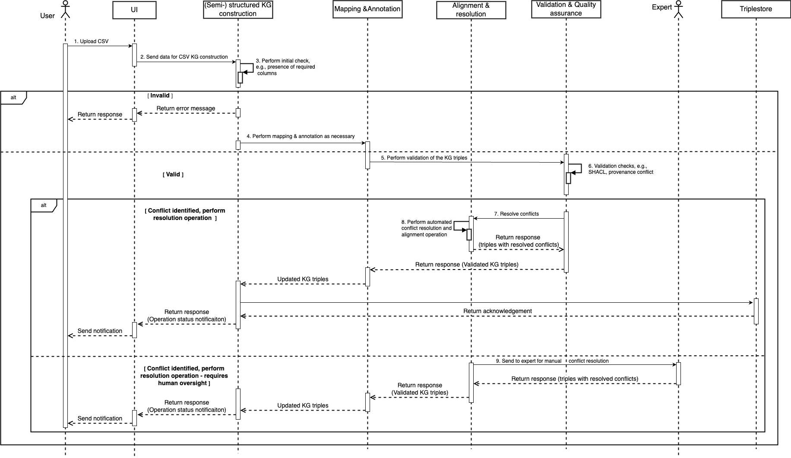

# BrainyPedia Design Document

## Overview
_BrainyPedia serves as a knowledge base platform that provides scientists worldwide with tools for searching, exploring, and visualizing Neuroscience knowledge represented by knowledge graphs (KGs)_. Moreover, BrainyPedia provides cutting-edge tools that enable scientists to contribute new information (or knowledge) to the platform, ensuring it remains the go-to destination for all neuroscience-related research needs.

The main objective of BrainyPedia is to represent Neuroscience knowledge as a knowledge graph such that it can be used for different downstream tasks, such as making predictions and new inferences in addition to querying and viewing information.  The expected outcome of the BrainyPedia includes the following:

- (Semi-)Automated extraction of Neuroscience knowledge from structured, semi-structured, and unstructured sources, representing the extracted knowledge via KGs.
 
- Visualization of the KGs.

- Provides features to perform different analytics operations over the BrainyPedia KGs.
- (Semi-)automatically validates (e.g., quality) the extracted KGs to ensure that the BrainyPedia KGs are high quality. 
- Provides the ability to ingest data in batch or streaming mode for the automated extraction of KGs.

## Principles

### Data Ingestion
BrainyPedia will support the data from various sources in different formats  (e.g., texts, JSON (JavaScript Object Notation)) for knowledge extraction via the BrainyPedia user interface (UI) and the API endpoints. Both batch and streaming data ingestion modes will be supported.

### Schema Flexibility
KGs evolve over time. Therefore, BrainyPedia will support this evolution by allowing the addition (or removal) of entities and relationships (or new knowledge).

### Maintainability
BrainyPedia shall be maintainable, allowing operations such as KG enrichment and validation to be performed easily.

### Curation
BrainyPedia will allow the community-driven curation of the KGs as well as (semi-) automated extraction and construction of KGs from external sources, e.g, scientific literatures.

### Accuracy, Completeness and Consistency (ACC)
BrainyPedia shall ensure the accuracy of the knowledge for which multi-step (semi-) automated validations will be performed. Additionally, checks will also be performed to ensure that the KG triples are complete, i.e., the mandatory information is present. Further to accuracy and completeness, BrainyPedia shall ensure that adding the new facts (or KG triples) will not lead to inconsistency (see figure below) with existing knowledge due to factual errors, data inconsistencies, and incompleteness.

_Figure 1: KGs. The image on the left shows the original knowledge graph, while the image on the right demonstrates the updated knowledge graph. The green highlighted box indicates new knowledge that has been added, while the red highlighted box indicates any inconsistencies caused by factual changes._

The ACC process will ensure human-centricity is maintained alongside automated validation.

### Provenance
To enable trust, the provenance, such as the source of the information and the curators (in the case of manual) of all the information, shall be maintained. The provenance conflict resolution mechanism will also be implemented to ensure the accuracy of the provenance information.

### Querying and Reasoning
BrainyPedia shall support the KGs' querying and reasoning. It shall also support other downstream analytics tasks, such as link predictions using machine learning techniques.

### Integration and Interoperability
To ensure interoperability and ease of integration, BrainyPedia will focus on using standardized ontologies or schemas. However, not all standardized ontologies or schemas are available. In such cases, other schemas or ontologies must be used. To ensure the interoperability, the alignment will be performed where necessary.

### Minimize Cognitive Burden and Data Fatigue
As BrainyPedia will also provide features to perform the analytics operation in addition to querying the information (or knowledge), a special emphasis shall be placed on ensuring that the information presented to the user does not cause a cognitive burden and data fatigue.  For example, the figure below (left) places more cognitive burden than on the right.

## Other considerations

__Assumption:__We operate on open-world assumptions (OWA), not closed-world assumptions (CSA). In OWA, we do not make any assumptions about the absence of statements, while in CSA absence of statements would be evaluated as false, i.e., assumed to be false.

## Architecture
The figure below shows the high-level overview of the components of the BrainyPedia architecture.

__Application:__ The application (or the application layer) is the go-to point that provides access to BrainyPedia, such as via UI.

__Service:__ The service layer implements the core logic and is broken down into multiple services based on the functionalities. Furthermore, the services are divided into two layers, layer 1 and layer 2 as indicated by L1 and L2 in the figure below. This is to distinguish what will be exposed to the outside world. The L1 services will expose the API endpoints for external integration while the L2 services will not. L2 services interact with L1 services only. 

__Resource:__ The resource will provide the necessary computational resources that are required to deliver the required service by BrainyPedia.

## Sequence diagram

The sequence diagram below shows the interactions between different service components for the KG construction.

