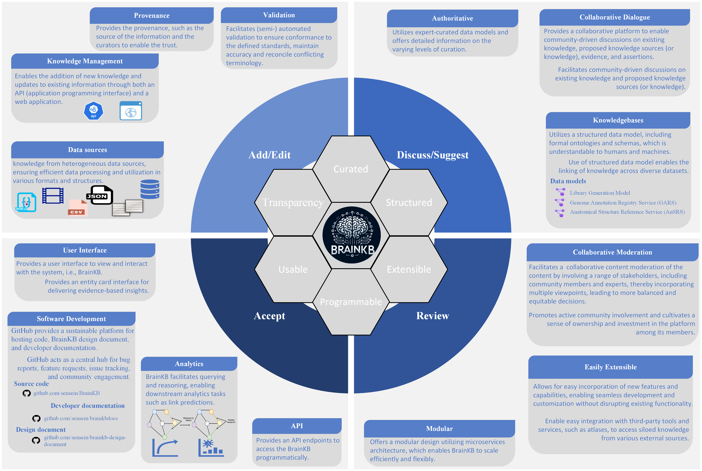
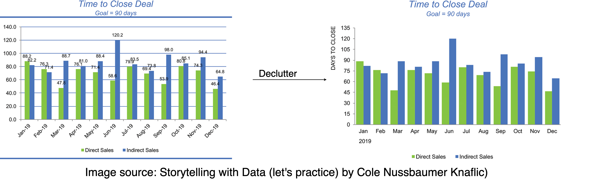
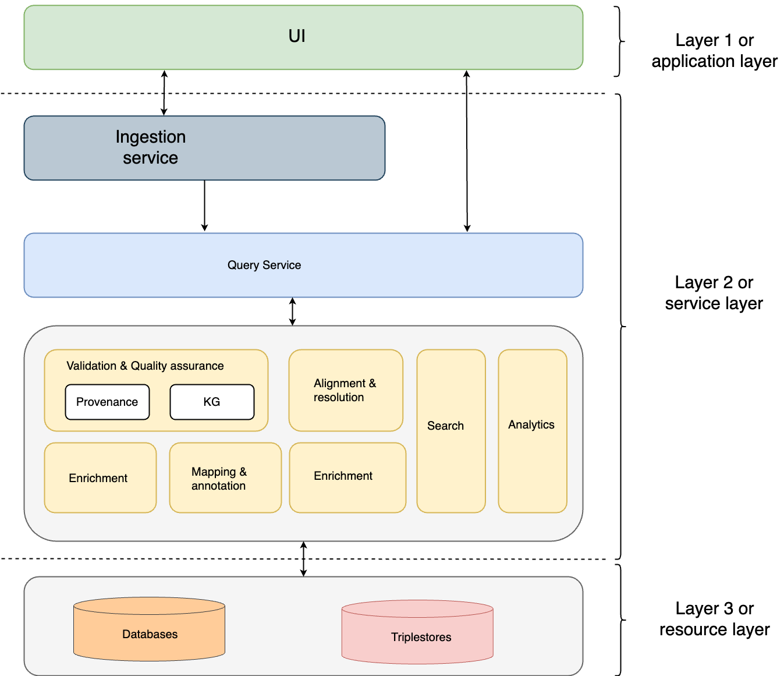
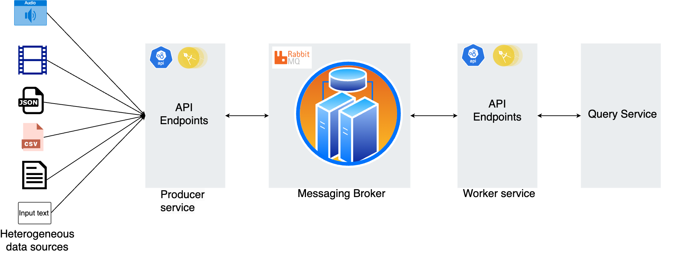
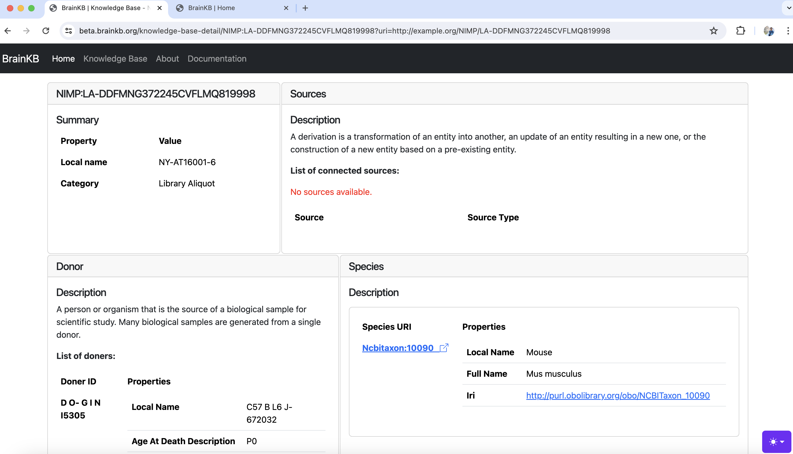

# BrainKB Design Document

**Author:** Tek Raj Chhetri | <tekraj@mit.edu>

## Overview
_BrainKB serves as a knowledge base platform that provides scientists worldwide with tools for searching, exploring, and visualizing Neuroscience knowledge represented by knowledge graphs (KGs)_. Moreover, BrainKB provides cutting-edge tools that enable scientists to contribute new information (or knowledge) to the platform and is expected to be a go-to destination for all neuroscience-related research needs.

The main objective of BrainKB is to represent neuroscience knowledge as a knowledge graph such that it can be used for different downstream tasks, such as making predictions and new inferences in addition to querying and viewing information.  The expected outcome of the BrainKB includes the following:

- (Semi-)Automated extraction of neuroscience knowledge from structured, semi-structured, and unstructured sources, and representing the knowledge via KGs.
 
- Visualization of the KGs.

- Platform to perform different analytics operations over the BrainKB KGs.
- (Semi-)Automated validation of the BrainKGs to ensure the high quality of the content. 
- Provides the ability to ingest data in batch or streaming mode for the automated extraction of KGs.

## Why BrainKB?

- **Limited Availability of Platforms for Integrating Neuroscience Data into Knowledge Graphs:** In fields such as biomedicine, many platforms exist, such as, [SPOKE](https://doi.org/10.1093/bioinformatics/btad080) and [CIViC](https://civicdb.org/welcome). However, such resources are comparatively limited in the domain of neuroscience. [LinkRBrain](https://doi.org/10.1016/j.jneumeth.2014.12.008), a web-based platform that integrates anatomical, functional, and genetic knowledge, is among the limited number of such resources. [BrainKnow](http://www.brain-knowledge-engine.org/), the most recent platform, is another platform that is designed to [synthesize and integrate neuroscience knowledge from scientific literature](https://arxiv.org/pdf/2403.04346.pdf). Additionally, projects like [DANDI](https://dandiarchive.org/), [EBRAINS](https://www.ebrains.eu/data/find-data/find-data/) and [Open Metadata Initiative](https://github.com/openMetadataInitiative) are making strides by enabling sharing of neurophysiology data together with its metadata. 

- **Lack of Support for Heterogeneous Data Sources:** The current platforms in neuroscience are limited in their ability to handle a diverse range of data sources. For instance, [LinkRBrain](https://doi.org/10.1016/j.jneumeth.2014.12.008) can only integrate knowledge from 41 databases, whereas [BrainKnow](http://www.brain-knowledge-engine.org/) solely focuses on scientific literature. However, knowledge is not restricted to just databases or scientific literature, and there is a need for platforms that can accommodate a wider variety of sources (e.g., structured, semi-structured and unstructured sources).

 

## Principles

### Structured (Modeled)
 All information stored in the KG has associated data models or can be extracted to models. The information will be linked to formal ontologies and linked across datasets. All data models will have well defined schemas and descriptors for human and programmatic consumption.

### Extensible (Read/Write)
The KG will allow for both information retrieval and upload. This involves a set of services and an API layer that allows for curation of information. The curation of information will reflect the data models. In addition, the KG will link, ingest, or cache other authoritative sources of information.

### Curated (Expertise)
To support being an authoritative source, information entering the KG will indicate levels of curation. Such curation may take the form of expertise that is embedded into algorithms (e.g., quality metrics, alignment, mapping), is incorporated into data models (e.g., genes, anatomy), and is derived from computational and human analysis (e.g., atlases as outputs of working groups).
### Usable (Utilitarian)
The architecture of the KG will be usable by humans and computational entities. The application interfaces will provide user interactivity and programmatic access. The KG will support competencies needed by the community. 
### Transparent (Basis)
To increase trust, the provenance of all information in the KG shall be maintained, including absence of provenance and available through the KG interfaces.
### Programmable (Computable) 
The information stored will lend itself to compute through appropriate APIs, data formats, and services. The KG shall connect to computational services to generate and provide inferred or derived information relevant to scientists. 

## Features

### Data Ingestion
BrainKB will support knowledge extraction from various sources in different data formats  (e.g., texts, JSON (JavaScript Object Notation)) via the BrainKB user interface (UI) and the application programming interface (API) endpoints. Both batch and streaming data ingestion modes will be supported.
 

### Schema Flexibility
KGs evolve over time. For example, if we consider the case of the president of a country, it changes overtime. The KGs storing the information regarding the president of the country has to be updated accordingly. There are  many similar cases in neuroscience or any other domain. The knowledge may change over time based on new research findings, thereby making previous knowledge obsolete or factually incorrect. Additionally, changes might also occur in the schema due to the standardization, alignment or updates. While schema changes may not always be necessary, they may be required to accommodate new information. Therefore, BrainKB will support the evolution by allowing the addition (or removal) of entities and relationships.

- **Example:** The concepts may change over time, for example, due to major guideline changes or adoption of different standards, or they might become obsolete. For instance, in fields like biology, [newer findings can invalidate existing terms](https://wiki.geneontology.org/Principles_for_term_obsoletion), requiring flexibility in the schema to account for future changes. 

### Maintainability
BrainKB shall be maintainable, allowing operations such as KG enrichment and validation to be performed easily.

### Curation
BrainKB will allow the community-driven curation of the KGs as well as (semi-) automated extraction and construction of KGs from external sources, e.g, scientific literatures.

### Accuracy, Completeness and Consistency (ACC)
BrainKB shall check the accuracy of the knowledge for which multi-step (semi-) automated validations will be performed. Additionally, checks will be performed to ensure that the KG triples are complete, i.e., the mandatory information is present. Further to accuracy and completeness, BrainKB shall ensure that adding the new facts (or KG triples) will not lead to inconsistency (see figure below) with existing knowledge due to factual errors, data inconsistencies, and incompleteness.

_Figure 1: KGs. The image on the left shows the original knowledge graph, while the image on the right demonstrates the updated knowledge graph. The green highlighted box indicates new knowledge that has been added, while the **red highlighted box** indicates any inconsistencies caused by factual changes, i.e., **incorrect date of birth**._

The ACC process will ensure human-centricity is maintained alongside automated validation.

### Provenance
To enable trust, the provenance, such as the source of the information and the curators (in the case of manual) of all the information, shall be maintained. The provenance conflict resolution mechanism will also be implemented to ensure the accuracy of the provenance information.

### Querying and Reasoning
BrainKB shall support the KGs' querying and reasoning. It shall also support other downstream analytics tasks, such as link predictions (see Figure 2) using machine learning techniques.

_Figure 2: Link prediction. The figure on the left indicates a KG with a missing link (or relation) indicated by dotted lines and the figure on the right displays the KG after the link prediction._

### Integration and Interoperability
To ensure interoperability and ease of integration, BrainKB will focus on using standardized ontologies or schemas. However, not all standardized ontologies or schemas are available. In such cases, other schemas or ontologies must be used. To ensure the interoperability, the alignment will be performed where necessary.

### Minimize Cognitive Burden and Data Fatigue
As BrainKB will also provide features to perform the analytics operation in addition to querying the information (or knowledge), a special emphasis shall be placed on ensuring that the information presented to the user does not cause a cognitive burden and data fatigue. A cognitive burden occurs when the brain must exert more effort to understand information, typically resulting from an overload of visual content. For example, the figure below (left) places more cognitive burden than on the right.

## Other considerations

__Assumption:__ We operate on open-world assumptions (OWA), not closed-world assumptions (CSA). In OWA, we do not make any assumptions about the absence of statements, while in CSA absence of statements would be evaluated as false, i.e., assumed to be false.

## Architecture
The figure below (Figure 3) shows the BrainKB's architecture. It is divided into three layers: application (layer 1), service (layer 2), and resource (layer 3).

__Application:__ The application (or the application layer or layer 1) is the go-to point that provides access to BrainKB, such as via UI.

__Service:__ The service layer (or layer 2) implements the core logic and is broken down into multiple services based on the functionalities.  
__Resource:__ The resource (or layer 3) will provide the necessary computational resources that are required to deliver the required service by BrainKB.

_Figure 3: Architecture of BrainKB_

Additionally, Figure 4, shows the architecture of the ingest service, a component of BrainKB.

_Figure 4: Ingest Service_

## Target Audience

- **Neuroscience researchers:** BrainKB's primary audience is neuroscience researchers, who can use the platform to integrate, visualize, and analyze neuroscience data. They can also capitalize on the platform's ability to synthesize their data (or knowledge) into KGs.

- **Research Labs and Academic Institutions:** BrainKB will be an invaluable resource for teaching and research in academic contexts specializing in neuroscience research. It offers convenient access to integrated neuroscience data for faculty and students.

- **Policy Makers and Healthcare Professionals:** Neurology policymakers can use BrainKB, aka the neuroscience knowledge that BrainKB hosts, to make policy decisions. Furthermore, healthcare professionals in neurology (or clinical neuroscience) may also use BrainKB knowledge to understand and improve neurological disease outcomes.

- **Neuroscience-related Companies:** Companies specializing in developing drugs for neurological diseases can use the platform's KGs to gain insights into neurological conditions and treatments.

## Usage Scenario
**Actor:** Alice (Neuroscientists)

**Task:** Alice wants to know if he can gain new insights from their newly collected neuroscience data.

**Precondition:** The newly collected neuroscience dataset, which includes demographics, gene expression maps, and structural and functional MRI scans, is usable and uncorrupted.

**Flow:**

1. Alice uploads the data into the BrainKB platform through the BrainKB UI (User Interface).
2. BrainKB, the system, then analyzes data. If any error, e.g., unsupported file format, it will return the error; otherwise, the system will proceed to the next step of knowledge extraction.
3. The system will perform the knowledge extraction, validation, and alignment operation. If the validation or the alignment issue cannot be resolved automatically, the extracted knowledge represented via KG is flagged for expert review. Upon the successful review, the KGs are integrated (or stored) in the BrainKB storage and is available for visualization and analysis.

**Postcondition:** Alice discovers new insights through the integration of diverse knowledge sources represented in BrainKB's KGs.

## Use cases

- **Extraction/Integration/Refinement:** BrainKB will provide features to extract knowledge from diverse sources, such as raw text and scientific publications, and integrate it with the knowledge represented via KGs. Additionally, BrainKB will also provides features to refine the extracted knowledge, e.g., through humans in the loop.

- **Cards:** The BrainKB web application allows easy visualization of the knowledge of interest to scientists/researchers stored in KGs and their corresponding interconnected knowledge. Figure 4 shows a snippet of the entity card from the BrainKB web application, which can be accessed at [http://beta.brainkb.org](http://beta.brainkb.org).

	
	_Figure 4: Snippet of Entity card from BrainKB web application_
 
- **Casual Inference:** Casual inference helps distinguish causation from correlation, particularly important the domains like neuroscience [1,2]. BrainKB, which stores the knowledge represented via KGs, thus supports causal inference. The reason is that the KGs can encode the (casual) relationships between entities and enable (casual) reasoning [2].

	[1] _Danks, D. and Davis, I., 2023. Causal inference in cognitive neuroscience. Wiley Interdisciplinary Reviews: Cognitive Science, 14(5), p.e1650._
	[2] _Huang, H. and Vidal, M.E., 2024. CauseKG: A Framework Enhancing Causal Inference with Implicit Knowledge Deduced from Knowledge Graphs. IEEE Access._
		
- **Human in the loop:**
BrainKB allows the creation of KGs constructed from heterogeneous sources, e.g., text and CSV files, in a (semi-) automated fashion (e.g., using NLP) and through community contribution. BrainKB includes human-in-the-loop features, which ensure quality control of the KGs. The human in the loop is also a step in the maturity model for operations in neuroscience [1], helping to optimize KGs (knowledge graphs) curation.
	- **Example:**
		- When new evidence is submitted, it is placed in a queued (or hold) stage and progressed upon the moderators' review. Changes might be required based on the review before it appears in the evidence entity card.
		- If the KGs are manually or automatically created, the moderators will review the concepts' alignment and determine whether the resolution (e.g., entity resolution) has been performed correctly.

			
	[1] _Johnson, E.C., Nguyen, T.T., Dichter, B.K., Zappulla, F., Kosma, M., Gunalan, K., Halchenko, Y.O., Neufeld, S.Q., Schirner, M., Ritter, P. and Martone, M.E., 2023. A maturity model for operations in neuroscience research. arXiv preprint arXiv:2401.00077._

- **Compare Atlases:** BrainKB also integrates knowledge from diverse knowledge platform services if available for integration, providing the feature to compare knowledge from across different atlases (e.g., Allen Brain Atlases). 

- **Find/correct Errors:** BrainKB will provide a feature to search existing knowledge and correct errors if any. 

- **Add information/API:** BrainKB offers an API endpoint that enables seamless integration with its platform. These endpoints facilitate data ingestion from various sources, such as CSV files or raw text, for constructing KGs, performing search operations, and conducting analyses on the stored KGs.

- **Doing meta-analysis:** Meta-analysis is a knowledge-intensive task that requires significant time and effort to find related studies, identify evidence items, annotate the contents, and aggregate the results [1]. BrainKB, which stores knowledge from diverse data sources, including scientific publications, facilitates the meta-analysis.

	[1] _Tiddi, I., Balliet, D. and ten Teije, A., 2020. Fostering scientific meta-analyses with knowledge graphs: a case-study. In The Semantic Web: 17th International Conference, ESWC 2020, Heraklion, Crete, Greece, May 31–June 4, 2020, Proceedings 17 (pp. 287-303). Springer International Publishing._

## Models
Models currently used in BrianKB:

- Genome Annotation Registry Service (GARS) Model
- Anatomical Structure Reference Service (AnSRS) Model
- Library Generation Model

Detailed descriptions of the models above are available at [https://brain-bican.github.io/models/](https://brain-bican.github.io/models/). 

## Technology
- [FastAPI](https://fastapi.tiangolo.com/)
- [Docker](https://www.docker.com/)
- [RabbitMQ](https://www.rabbitmq.com/)
- Serverless ([OpenFaaS](https://www.openfaas.com/))
- [Python](https://www.python.org/)
- Language models ((e.g., Google BERT and LLaMa)
- [SPARQL](https://www.w3.org/TR/sparql11-query/)

## Sequence diagram

The sequence diagram below shows the interactions between different service components for the KG construction.

## Github Repository 

- **Source code**
	- [https://github.com/sensein/BrainKB](https://github.com/sensein/BrainKB)
- **Developer documentation**
	- [https://github.com/sensein/brainkbdocs](https://github.com/sensein/brainkbdocs) 	
	
## Timelines 

| Date       | Event                          |
|------------|--------------------------------|
| 2024-03-26 | Project Conceptualization      |
| 2024-04-05 | Initial Architecture Design Phase Completed |
| 2024-04-23 | Work on Design Document      |
| 2024-04-25 | Development Phase Started      |
| 2024-05-25 | First version of BrainKB   |
| 2024-12-25 | Second version of BrainKB  |
| 2025-04-10 | First complete version of BrainKB with all conceptualized features                |

## Status 

| Status       | Event                          |
|------------|--------------------------------|
| Completed | <s>Project Conceptualization</s>     |
| Completed, updated the architecture | <s>Initial Architecture Design Phase Completed</s> |
| Initial version completed and is updating | Work on Design Document      |
| Completed | <s>Development Phase Started</s>      |
| Completed and first version has been deployed to AWS | <s>First version of BrainKB</s>  |
| 2024-12-25 | Second version of BrainKB  |
| 2025-04-10 | First complete version of BrainKB with all conceptualized features                |

